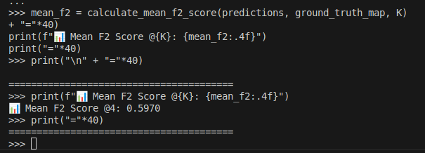

# Curriculum Recommendation System for Newsela

## Overview of Approach

This project implements a **Two-Tower Neural Recommendation System** using TensorFlow Recommenders to predict which educational content should be associated with specific curriculum topics. The fundamental insight behind this approach is that both topics and content can be represented as vectors in the same mathematical space, where semantically related items naturally cluster together.

The two-tower architecture consists of a **Query Tower** that processes topic information and a **Candidate Tower** that processes content identifiers. During training, the model learns to position related topic-content pairs close together in this vector space while pushing unrelated pairs apart. This creates a powerful semantic understanding that can generalize to new, unseen topic descriptions.

This solution and idea was obtained from an article I wrote in August of 2022: [Train and Deploy Two Towers Recommender](https://medium.com/@rubenszimbres/train-and-deploy-google-clouds-two-towers-recommender-3ae5c29891af "Train and Deploy Two Towers Recommender"). The algorithm maps contents to topics. To map topics to contents, it is necessary to exchange the Query and Candidate Towers.

### Why This Approach Works

Traditional content recommendation systems often rely on collaborative filtering or simple keyword matching. However, educational content requires understanding conceptual relationships and hierarchical knowledge structures. By combining a topic's title, description, and ancestral path in the curriculum hierarchy, I created rich semantic representations that capture both explicit content and implicit educational context.

The preprocessing strategy of filtering words longer than three characters removes common stop words while preserving meaningful academic terminology. The strategy of using only lowercase words makes embeddings generation more efficient. This helps the model focus on substantive concepts rather than grammatical noise.

## Code Access Point

**Start here: `train.py`** - This is the main training script that orchestrates the entire machine learning pipeline.

The script follows a logical progression that mirrors how you would approach this problem manually. Begin by understanding the data loading section , then examine how topic features are engineered, and finally study the model architecture definition in the `CurriculumModel` class.

For predictions and inference, examine **`predict_template.py`**, specifically the `TopicPredictor` class. The key method is `predict()`, which demonstrates how to preprocess new topic queries and generate recommendations using the trained model. A sample query is provided for checking.

### Understanding the Training Process

The training script implements a curriculum learning pipeline that can be understood in five distinct phases:

**Phase 1: Data Preparation and Feature Engineering**
The script begins by loading three essential datasets: topics, content, and their correlations. The most crucial step occurs in the feature engineering phase, where each topic receives a comprehensive textual representation. This process creates an "ancestor path" by tracing each topic's lineage back to its root category, forming breadcrumb trails like "Science >> Physics >> Electromagnetism". This hierarchical context is then combined with the topic's title and description to create a single, semantically rich text feature called `topic_full_text`.

**Phase 2: Training Data Construction**
The correlation data, which defines ground truth relationships between topics and content, undergoes transformation using pandas' explode function. This converts the many-to-many relationships into individual training pairs, creating a dataset where each row represents a single valid topic-content association. This approach ensures the model learns from clear, unambiguous examples.

**Phase 3: Vocabulary Creation and Preprocessing**
The script builds two distinct vocabularies: one for tokenizing topic text and another for encoding content identifiers. The topic vocabulary uses TensorFlow's StringLookup layer to convert words into numerical indices, while the content vocabulary maps content IDs to embedding indices. This preprocessing step is critical because it determines how the model will interpret and process input data during both training and inference.

**Phase 4: Model Architecture Implementation**
The `CurriculumModel` implements the two-tower architecture through neural networks. The Query Tower processes topic text by splitting it into individual words, converting each word to an embedding vector, and summing these embeddings to create a single topic representation. The Candidate Tower generates embeddings for content IDs through a simpler lookup mechanism. Both towers produce vectors in the same dimensional space, enabling direct similarity comparisons.

**Phase 5: Training and Evaluation**
The model trains using TensorFlow Recommenders' Retrieval task, which implements a sophisticated loss function that pulls related topic-content pairs together while pushing unrelated pairs apart. After training, the script evaluates performance using the Mean F2 Score, a metric that balances precision and recall while emphasizing recall more heavily than traditional F1 score.

## Metrics

The model's performance is evaluated using the **Mean F2 Score @ K=4**, which provides a comprehensive assessment of recommendation quality.

| Metric | Score | Description |
|--------|--------|-------------|
| Mean F2 Score @ K=4 | 0.5970 | Harmonic mean of precision and recall with recall weighted 2.5x more than precision |



This F2 score is equivalent to a bronze medal on the Kaggle Competition.

### Understanding the F2 Score

The F2 score is particularly appropriate for educational recommendation systems because it prioritizes recall over precision. In an educational context, it's generally better to include a few extra potentially relevant resources rather than miss important learning materials. The F2 score weights recall 2.5 times more heavily than precision, making it ideal for scenarios where comprehensive coverage matters more than perfect accuracy.

The "@ K=4" notation indicates that we evaluate based on the top 4 recommendations for each topic. This constraint reflects real-world usage patterns where educators typically review a small number of suggested resources rather than extensive lists.


## What Would I Have Done With More Time?

**Implementation of Ranking Mechanism**: The current model handles only retrieval. An essential feature that must be implemented is Ranking. As you will see in training, accuracy for Top-10 is higher than 75%. With a proper Ranking algorithm, the F2 Score of this solution will improve.

**Hyperparameter Optimization**: The current model uses fixed hyperparameters (768-dimensional embeddings, Adagrad optimizer with 0.077 learning rate). A comprehensive grid search or Bayesian optimization approach could potentially improve performance significantly. Also, adding more layers to the Query and Candidate Towers may improve results.

**Enhanced Feature Engineering**: With additional time, I would explore more text preprocessing techniques, including experimentation with pre-trained language models like BERT/Gemini for creating initial word embeddings.

**Multi-Modal Learning**: Educational content often includes images, videos, and interactive elements. Expanding the model to incorporate visual and multimedia features could significantly improve recommendation relevance, especially for visual subjects like mathematics and science.


## Installation and Usage

### Setup
```bash
pip install -r requirements.txt
```
### Data Requirements

The project requires three CSV files in a `data/` directory:
- `topics.csv`: Contains topic hierarchy with id, title, description, and parent relationships
- `content.csv`: Contains educational content with id and title information
- `correlations.csv`: Defines which content items belong to which topics

### Training the Model
```bash
python3 train.py
```

This script will process your data, train the model, and save the trained index to `models/curriculum_recommender/`.

### Making Predictions

Download the weights from my Google Drive: [Model Weights](https://drive.google.com/file/d/1RjbhQ877LzMz4Obq6nSUFemfHvhOn0PZ/view?usp=sharing "Model Weights")

```bash
python3 predict_template.py --topic "Calculus and integrals" --neighbors 10
```

```bash
python3 predict_template.py --topic "Physics and properties of the matter" --neighbors 5
```

The prediction script demonstrates how to load the trained model and generate recommendations for new topics.
